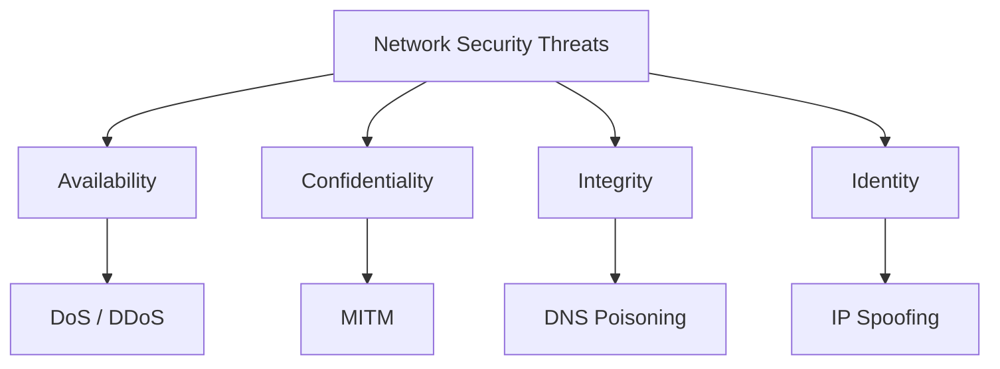

# Task 4 – Common Network Security Threats

## Overview

This project presents a research-based analysis of common network security threats and their potential impact on organisations, users, and network infrastructure.

The report focuses on **DoS/DDoS attacks, Man-in-the-Middle (MITM) attacks, IP spoofing, and DNS poisoning/spoofing**. For each threat, the report explains how the attack works, examines a documented real-world example, discusses its potential impact, and presents practical mitigation strategies.

The purpose of this research is to understand how network-level attacks can affect the **availability, confidentiality, integrity, and reliability** of systems and how network administrators can reduce these risks.

---

## Objectives

The main objectives of this task were to:

- Understand common network security threats.
- Explain how different network attacks operate.
- Analyse documented real-world security incidents.
- Identify the potential impact of each attack.
- Research practical mitigation strategies.
- Compare threats based on their attack vectors and risk.
- Provide security recommendations for network administrators.

---

## Threats Covered

| Threat | Primary Security Concern |
|---|---|
| **DoS / DDoS** | Availability and service disruption |
| **Man-in-the-Middle (MITM)** | Confidentiality and communication integrity |
| **IP Spoofing** | Identity and source-address deception |
| **DNS Poisoning / Spoofing** | Traffic redirection and integrity |

---

## Network Threat Overview

Different attacks target different parts of the security model, and a single incident may affect more than one security property.

---

## Key Findings

### 1. DoS and DDoS Attacks

DoS and DDoS attacks attempt to make a service, server, or network resource unavailable to legitimate users.

DDoS attacks are particularly challenging because traffic can originate from many compromised systems at the same time.

**Key protections include:**

- Traffic filtering and rate limiting
- DDoS protection services
- Network monitoring and incident-response procedures

---

### 2. Man-in-the-Middle Attacks

A MITM attack occurs when an attacker positions themselves between two communicating parties and attempts to observe or manipulate their communication.

The risk is particularly significant when communication is not properly encrypted or when users connect through untrusted networks.

**Key protections include:**

- HTTPS and TLS
- Secure authentication
- Network segmentation and secure Wi-Fi configuration

---

### 3. IP Spoofing

IP spoofing occurs when an attacker modifies packet information so that traffic appears to originate from a different IP address.

Spoofing can be used to bypass weak source-based controls, hide the true origin of traffic, or support other attacks.

**Key protections include:**

- Ingress and egress filtering
- Network access controls
- Monitoring for abnormal traffic patterns

---

### 4. DNS Poisoning / Spoofing

DNS poisoning or spoofing involves manipulating DNS information so that users are directed to an incorrect or malicious destination.

Because DNS is responsible for translating domain names into network addresses, manipulation of DNS responses can redirect users without changing the domain name they enter.

**Key protections include:**

- DNSSEC where appropriate
- Secure DNS infrastructure
- Monitoring and validation of DNS responses

---

## Comparison

| Threat | Attack Vector | Who Is at Risk? | Difficulty | Ease of Mitigation |
|---|---|---|---|---|
| DoS / DDoS | Excessive network/application traffic | Websites, servers, organisations | Medium–High | Medium |
| MITM | Intercepted network communication | Users and network services | Medium | Medium |
| IP Spoofing | Forged source IP address | Networks and exposed services | Medium | Medium |
| DNS Poisoning | Manipulated DNS responses | Users, applications, organisations | Medium–High | Medium |

The complete analysis and real-world case studies are provided in the full report.

---

## Recommended Security Practices

Network administrators should:

1. Monitor network traffic for unusual patterns.
2. Use encryption such as HTTPS/TLS for sensitive communication.
3. Apply network filtering and access-control policies.
4. Keep network infrastructure and security software updated.
5. Maintain incident-response procedures for network attacks.
6. Use secure DNS configurations and DNS monitoring.
7. Regularly review firewall, router, and network security policies.

---

## Report

The complete research report is available here:

**[Read the Full Network Security Threats Report](network_security_threats_report.md)**

---

## Tools and Resources

- Markdown
- GitHub
- NIST
- CISA
- SANS Institute
- MITRE ATT&CK
- Wireshark documentation
- Reputable cybersecurity publications

---

## Ethical Considerations

This project is research-oriented and does not involve attacking real systems or networks.

Network security testing should only be performed on systems and networks that are owned, administered, or explicitly authorised for testing.

---

## Conclusion

Network security threats can affect the availability, confidentiality, integrity, and trustworthiness of digital systems.

Understanding how attacks such as **DDoS, MITM, IP spoofing, and DNS poisoning** work allows network administrators to select appropriate defensive controls and respond more effectively to incidents.

The most effective approach is a layered security strategy combining **monitoring, secure protocols, access controls, network filtering, regular updates, and incident-response planning**.
