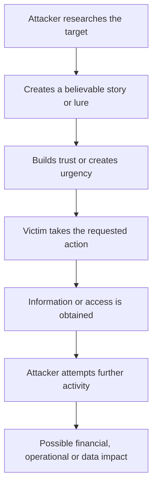

# Task 5 – Social Engineering Attacks

## Overview

This project presents a research-based analysis of social engineering attacks, focusing on **phishing, pretexting, and baiting**.

Social engineering attacks exploit human behaviour rather than relying exclusively on technical vulnerabilities. Attackers may manipulate trust, urgency, authority, curiosity, fear, or the expectation of receiving a benefit to persuade victims to perform unsafe actions.

The report examines how these techniques work, documented real-world cases, their potential impact, and practical measures organisations can use to reduce the risk.

---

## Objectives

The main objectives of this task were to:

- Understand social engineering and why it is an effective attack vector.
- Study phishing and its major variants.
- Examine pretexting and impersonation techniques.
- Understand physical and digital baiting.
- Analyse documented real-world case studies.
- Identify practical prevention and mitigation measures.
- Compare different social engineering techniques.
- Develop an employee security-awareness checklist.

---

## Attack Types Covered

| Attack Type | Description |
|---|---|
| **Phishing** | Fraudulent communication designed to trick victims into taking an unsafe action |
| **Spear Phishing** | Targeted phishing aimed at a specific person or organisation |
| **Whaling** | Highly targeted phishing aimed at executives or other high-value individuals |
| **Vishing** | Phishing conducted through voice communication |
| **Smishing** | Phishing conducted through SMS or messaging services |
| **Pretexting** | Manipulation using a fabricated identity or believable scenario |
| **Baiting** | Using an attractive physical or digital lure to encourage unsafe behaviour |
| **Quid Pro Quo** | Offering a perceived benefit in exchange for information or access |

---

## How Social Engineering Works

Social engineering attacks generally involve creating a believable situation and persuading the victim to perform an action that benefits the attacker.

The exact technique varies, but the central element is the manipulation of human behaviour.

---

## Key Findings

### Phishing

Phishing can be delivered through email, websites, SMS, phone calls, and other communication platforms.

Targeted variants such as spear phishing and whaling can use information about individuals or organisations to make fraudulent communications more convincing.

### Pretexting

Pretexting relies on a fabricated scenario or identity. Attackers may impersonate managers, IT personnel, financial staff, service providers, or other trusted individuals.

### Baiting

Baiting uses curiosity, perceived value, or rewards to encourage a victim to interact with malicious content.

Examples include:

- Unknown USB drives
- Fake software downloads
- Malicious documents
- Attractive online offers
- Suspicious QR codes

### Quid Pro Quo

Quid pro quo attacks offer a perceived benefit in exchange for information or access. A common example is an attacker pretending to provide technical support while requesting credentials or verification information.

---

## Real-World Case Studies

The full report analyses documented social engineering incidents, including:

- **2011 RSA SecurID breach** — targeted phishing was used to obtain access to RSA's environment.
- **2020 Twitter compromise** — attackers used social engineering against employees before compromising high-profile accounts.
- **Ubiquiti Networks fraud** — impersonation and fraudulent instructions contributed to approximately $46.7 million in wire transfers.
- **University of Illinois USB study** — an ethical research experiment demonstrated that people may connect unknown USB devices.

These cases demonstrate that social engineering can result in **credential theft, unauthorised access, financial loss, data exposure, and operational disruption**.

---

## Prevention and Mitigation

Organisations should use a layered approach to reduce social engineering risk.

### 1. Security Awareness Training

Employees should regularly practise identifying phishing, impersonation, suspicious links, unexpected attachments, and unusual requests.

### 2. Strong Authentication

Use multi-factor authentication, with phishing-resistant authentication preferred for sensitive and privileged accounts.

### 3. Independent Verification

Sensitive requests involving money, credentials, account changes, or confidential information should be independently verified using a trusted communication channel.

### 4. Technical Security Controls

Organisations should use appropriate:

- Email filtering
- URL protection
- Attachment scanning
- Endpoint security
- Access controls
- Monitoring

### 5. Clear Reporting Procedures

Employees should have an easy way to report suspicious messages or social engineering attempts.

---

## Employee Security Awareness Checklist

Employees should be encouraged to:

- [ ] Verify unexpected requests before acting.
- [ ] Avoid suspicious links and unexpected attachments.
- [ ] Never share passwords or MFA verification codes.
- [ ] Independently verify unusual payment or account requests.
- [ ] Report suspected social engineering attempts immediately.

---

## Comparison

| Attack Type | Primary Target | Psychological Lever | Best Countermeasure |
|---|---|---|---|
| Phishing | Employees / users | Trust, urgency | Awareness + email security |
| Spear Phishing | Specific employees | Trust, personalization | Verification + MFA |
| Whaling | Executives | Authority, urgency | Independent approval |
| Vishing | Employees / customers | Authority, fear | Caller verification |
| Smishing | Mobile users | Urgency, curiosity | Link verification |
| Pretexting | Finance / IT / employees | Trust, authority | Independent verification |
| Baiting | Employees / users | Curiosity, reward | Media controls + awareness |
| Quid Pro Quo | Employees / users | Reciprocity, reward | Verify the offer |

---

## Report

The complete research report is available here:

**[Read the Full Social Engineering Research Report](social_engineering_report.md)**

---

## Tools and Resources

- Markdown
- GitHub
- CISA security guidance
- SANS Institute
- MITRE ATT&CK
- Verizon Data Breach Investigations Report
- Reputable cybersecurity publications
- Academic security research

---

## Ethical Considerations

This project is research-oriented and does not involve targeting real individuals or organisations.

Social engineering techniques should only be studied or simulated in environments where appropriate permission has been obtained. Security awareness exercises should be designed to educate participants rather than expose or punish them.

---

## Conclusion

Social engineering demonstrates that cybersecurity is both a technical and human challenge. Attackers can exploit trust, urgency, authority, curiosity, and perceived rewards to bypass security controls.

Organisations can reduce this risk by combining **security awareness training, strong authentication, independent verification, technical controls, and effective incident reporting**.

The full report provides detailed explanations, case studies, mitigation strategies, and organisational recommendations.
