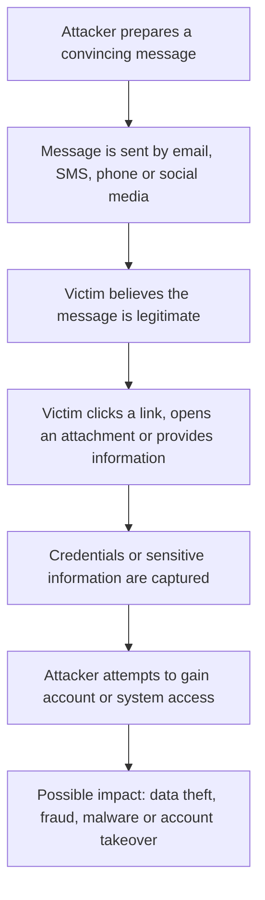
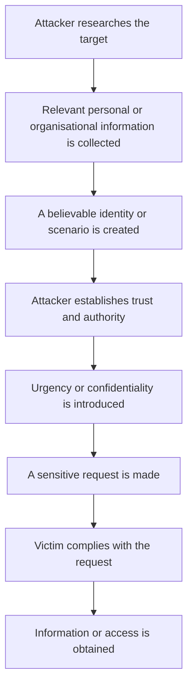
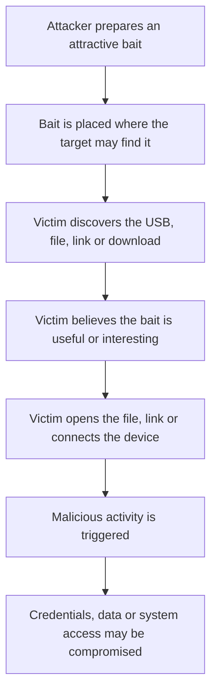
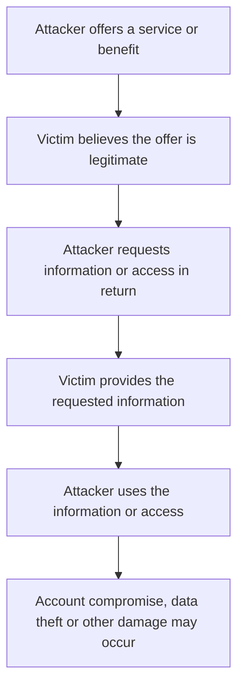

# Social Engineering Attacks: Phishing, Pretexting and Baiting

## 1. Introduction

Social engineering is the use of deception, manipulation, impersonation, or psychological influence to persuade people to perform an action that benefits an attacker. Instead of depending only on technical vulnerabilities, social engineering targets human trust, curiosity, fear, urgency, authority, or helpfulness. It remains a major cybersecurity concern because a technically strong security environment can still be bypassed when a legitimate user is persuaded to reveal information, approve a transaction, click a malicious link, or execute an unsafe file. Verizon's 2026 Data Breach Investigations Report recorded 5,302 social-engineering incidents, including 3,814 with confirmed data disclosure, and reported that email remains the preferred vector for most social-engineering breaches. Verizon also reported a 40% increase in mobile social-engineering success. SANS reported in its 2025 Security Awareness Report that 80% of surveyed organizations ranked social engineering as their number-one human-related risk. [1][2]

---

## 2. Why Social Engineering Is Effective

Social engineering succeeds because attackers exploit predictable human behaviours rather than relying entirely on software flaws.

Common psychological levers include:

- **Trust:** pretending to be a colleague, manager, bank, IT employee, or known service.
- **Authority:** using the identity of a senior executive or official.
- **Urgency:** creating pressure to act immediately.
- **Fear:** threatening account suspension, financial loss, or disciplinary action.
- **Curiosity:** encouraging a victim to open an interesting file or unknown device.
- **Greed/reward:** offering free software, money, gifts, or exclusive information.
- **Helpfulness:** exploiting a person's willingness to assist another employee.

SANS describes social engineering as a common method in which attackers trick people into doing something they should not do. [2]

---

# 3. Phishing

## 3.1 Definition

Phishing is a form of social engineering in which an attacker impersonates a trusted person, organization, or service to persuade a victim to disclose information, click a malicious link, open an attachment, transfer money, or install malicious software.

CISA describes phishing as social engineering in which a threat actor poses as a trustworthy colleague, acquaintance, or organization. Successful phishing can result in initial access, data loss, identity fraud, malware infection, or ransomware. [3]

MITRE ATT&CK classifies phishing as **T1566** and identifies several sub-techniques, including spearphishing attachment, spearphishing link, spearphishing via service, and spearphishing voice. [4]

## 3.2 How Phishing Works

A typical phishing attack follows this sequence:

1. **Target selection** – The attacker identifies an individual or group.
2. **Lure creation** – A convincing message is prepared using a realistic subject, sender identity, branding, or scenario.
3. **Delivery** – The message is sent through email, SMS, social media, phone, or another communication platform.
4. **Victim interaction** – The victim clicks a link, opens an attachment, provides credentials, approves a request, or calls a number.
5. **Information theft or execution** – Credentials may be captured or malware may be delivered.
6. **Follow-on activity** – The attacker may access internal systems, steal data, commit fraud, or deploy ransomware.

### Phishing Attack Flow

A typical phishing attack begins with a convincing message and gradually attempts to move the victim toward an unsafe action.

**Example:** A victim receives an email claiming that their account will be disabled unless they verify it. The link leads to a fake login page designed to collect credentials.

## 3.3 Major Types of Phishing

### A. Spear Phishing

Spear phishing is a targeted phishing attack directed at a specific person, organization, or department. Attackers research the target and personalize the message using information such as the victim's name, job role, company projects, or colleagues.

MITRE notes that spearphishing can use malicious attachments or links and often relies on user execution. [4][5]

**Example:** An employee receives an email appearing to come from their manager containing an urgent document request.

### B. Whaling

Whaling is a highly targeted form of spear phishing aimed at senior or high-value individuals such as CEOs, CFOs, executives, or administrators.

**Example:** A CFO receives a message apparently from the CEO requesting an urgent confidential payment.

### C. Vishing

Vishing means **voice phishing**. The attacker uses a phone call or voice communication to impersonate a trusted person or organization.

MITRE ATT&CK identifies spearphishing voice as **T1566.004**. Attackers may impersonate IT staff, pressure users to reveal authentication information, or direct them to download software. [6]

**Example:** A caller claims to be from the IT help desk and asks an employee to verify an MFA code.

### D. Smishing

Smishing is phishing conducted through SMS or other text messaging services.

**Example:** A victim receives a message claiming that a bank account, parcel delivery, or online account requires immediate verification.

---

## 3.4 Phishing Case Study: 2011 RSA SecurID Breach

In 2011, RSA Security disclosed a major breach involving information related to its SecurID authentication products. The initial compromise began with targeted phishing emails sent to employees of RSA's parent company, EMC.

According to WIRED's investigation, attackers sent targeted phishing emails to four employees. The message contained a malicious Excel attachment named **"2011 Recruitment plan.xls"**. One employee retrieved the message from the junk folder and opened the attachment. The attachment exploited a Flash vulnerability and installed a backdoor, providing the attackers with a foothold inside the environment. The attackers subsequently stole information associated with RSA's SecurID authentication products. [7]

The incident demonstrated an important security lesson: a relatively small number of carefully targeted phishing messages can lead to a major compromise when one user trusts the lure.

### Impact

- Sensitive SecurID-related information was stolen.
- RSA had to take significant protective measures for customers.
- Defense contractors, including Lockheed Martin, were subsequently targeted using stolen SecurID-related information.
- The incident demonstrated the potential supply-chain consequences of a successful phishing attack. [7][8]

---

## 3.5 Four Phishing Prevention Recommendations

### 1. Verify unexpected requests independently

Do not rely on the contact details supplied in a suspicious message. Verify payment requests, credential requests, or unusual instructions using a known phone number, official portal, or separate communication channel.

### 2. Use strong email security controls

Organizations should deploy:

- Spam and phishing filtering
- Attachment scanning
- URL filtering
- Sender authentication such as SPF, DKIM, and DMARC
- External-sender warnings

CISA recommends strong email filtering and sender-authentication controls as part of reducing phishing and spoofing risk. [9]

### 3. Use phishing-resistant authentication

MFA reduces the damage caused by stolen passwords, while phishing-resistant methods such as FIDO2/WebAuthn security keys provide stronger protection against credential-phishing attacks.

### 4. Train and continuously test employees

Employees should receive regular scenario-based training covering phishing, smishing, vishing, suspicious links, attachments, and impersonation. Organizations should also make reporting suspicious messages easy and non-punitive.

---

# 4. Pretexting

## 4.1 Definition

Pretexting is a social engineering technique in which an attacker invents a believable scenario, or **pretext**, and then uses that scenario to manipulate a victim into providing information or performing an action.

The attacker may pretend to be:

- A manager or executive
- IT/help-desk staff
- A bank employee
- A supplier or contractor
- A lawyer
- A government official
- A customer or business partner

MITRE ATT&CK's Social Engineering/Impersonation technique describes how adversaries impersonate trusted people or organizations to persuade victims to take actions on their behalf. Attackers commonly combine impersonation with urgent or authoritative language. [10]

## 4.2 How an Attacker Builds a Pretext

### Pretexting Attack Flow

Pretexting relies on a believable story or false identity to persuade the victim to disclose information or perform an action.

**Example:** An attacker pretends to be an IT support employee and claims that an employee's account requires verification. The attacker then attempts to obtain sensitive information.

The attacker may first research the target through public information, company websites, social media, organizational charts, or previously exposed information.

The pretext is then constructed around a believable event such as:

> "There is a confidential acquisition and the finance team must process an urgent transfer."

The goal is to make the requested action appear normal within the invented scenario.

---

## 4.3 Pretexting Case Study: Ubiquiti Networks BEC Fraud (2015)

In 2015, Ubiquiti Networks disclosed a business email compromise fraud involving employee impersonation and fraudulent requests directed at its finance department.

According to Ubiquiti's SEC filings, fraudsters impersonated company personnel and used fraudulent instructions that resulted in **14 wire transfers totaling approximately $46.7 million** from a Hong Kong subsidiary to overseas accounts. [11]

The attackers created a believable business scenario involving senior personnel and an outside law firm. The combination of authority, confidentiality, and financial instructions created a convincing pretext for the finance function.

### Impact

- Approximately $46.7 million was transferred.
- The company recovered only part of the transferred funds.
- The incident exposed weaknesses in financial verification and authorization processes.
- The attack demonstrated that social engineering can cause major financial loss without requiring a technical network intrusion. [11][12]

### Key lesson

A request that appears to come from a senior executive should **not automatically be trusted because of the sender's identity or urgency**. High-risk financial actions should require independent verification and multiple approvals.

---

## 4.4 Three Pretexting Prevention Measures

### 1. Independent verification

Verify sensitive requests using a trusted communication channel. For example, confirm a wire-transfer request by calling the executive using a known company number.

### 2. Separation of duties

Require multiple authorized people to approve high-value payments, password resets, or access changes.

### 3. Identity verification and security training

Employees should be trained to challenge unusual requests even when the requester appears senior or authoritative. MITRE recommends user training and independent confirmation as defenses against impersonation. [10]

---

# 5. Baiting

## 5.1 Definition

Baiting is a social engineering attack that uses an attractive object, file, download, or offer to tempt a victim into taking an unsafe action.

The attacker relies mainly on:

- Curiosity
- Greed
- Interest in valuable information
- Desire for free software or media
- Assumption that a physical device is harmless

Baiting can be **physical** or **digital**.

---

## 5.2 Physical Baiting

Physical baiting involves placing a malicious or suspicious object where a target is likely to find it.

Common examples include:

- Infected USB drives
- Malicious CDs/DVDs
- Suspicious charging devices
- QR-code stickers
- Removable storage labelled "Confidential" or "Salary Information"

A common USB baiting flow is:
### Baiting Attack Flow

Baiting uses something attractive or interesting to encourage the victim to interact with malicious content or devices.

**Example:** A malicious USB drive is left in an organisation's premises with an interesting label. An employee connects it to a computer, allowing malicious content to execute or attempt to compromise the system.

MITRE ATT&CK documents the security implications of removable media and notes that adversaries have used infected USB devices to move information or commands between systems. [13]

---

## 5.3 Digital Baiting

Digital baiting uses an attractive online offer rather than a physical device.

Examples include:

- Fake free software
- Cracked applications
- Fake browser updates
- "Free" documents or templates
- Fake games or media
- Malicious downloads advertised as useful utilities

The victim downloads or opens the bait voluntarily, allowing malware or credential theft to occur.

---

## 5.4 Baiting Case Study: University of Illinois USB Drop Study

A well-documented study conducted by researchers from the University of Illinois, University of Michigan, and Google tested whether people would use USB drives they found.

Researchers placed **297 USB drives** around the University of Illinois Urbana-Champaign campus. The drives contained non-malicious research files that allowed the researchers to measure user interaction.

The study found that approximately **98% of the drives were picked up**, and about **45% were plugged into a computer and had a file opened**. The research demonstrated that a USB-drop attack is not merely theoretical: people can be persuaded to connect unknown removable media because of curiosity or perceived value. [14][15]

Importantly, this was an **ethical research experiment, not a malware incident**. The significance for cybersecurity is that a real attacker could replace the harmless research content with malicious content.

The U.S. Army Cyber Command has also highlighted the study as evidence of the effectiveness of USB baiting and recommends never plugging unknown media into organizational computers. [16]

---

## 5.5 Three Baiting Prevention Measures

### 1. Enforce removable-media policies

Organizations should prohibit unauthorized USB devices and clearly define approved removable-media procedures.

### 2. Disable unnecessary automatic execution

Disable AutoRun/AutoPlay where appropriate and use endpoint security controls to restrict unauthorized removable-media activity. MITRE lists disabling unnecessary AutoRun functionality as a mitigation for removable-media threats. [17]

### 3. Train employees to report found devices

Employees should never plug in an unknown USB drive or other suspicious device. Instead, they should report it to the IT/security team for safe handling.

---

# 6. Quid Pro Quo — Bonus

## 6.1 Definition

**Quid pro quo** means "something for something." In cybersecurity social engineering, the attacker offers a perceived benefit in exchange for information, access, or an action.

Examples include:

- Fake IT support offered in exchange for login credentials
- A supposed software upgrade requiring authentication details
- Fake technical assistance offered in exchange for remote access
- A fraudulent reward offered in exchange for personal information

### Example

### Quid Pro Quo Attack Flow

Quid pro quo attacks exploit the expectation of receiving a benefit in exchange for providing information or performing an action.

**Example:** An attacker claims to provide technical support or an account upgrade and asks the victim to provide credentials or a verification code in return.

### Prevention

- Never provide passwords or MFA codes to support personnel.
- Verify IT/support requests through official channels.
- Use approved help-desk procedures instead of accepting unsolicited assistance.
- Train employees to recognize "too good to be true" offers and unusual requests.

---

# 7. Comparison of Social Engineering Attacks

| Attack Type | Primary Target | Psychological Lever Exploited | Typical Delivery | Best Countermeasure |
|---|---|---|---|---|
| Phishing | General employees/users | Trust, fear, urgency | Email, web, messaging | Email security + user training + MFA |
| Spear Phishing | Specific employees | Trust and personalization | Email/message | Verification + phishing-resistant MFA |
| Whaling | Executives/CFOs/CEOs | Authority and urgency | Email/phone | Independent approval and verification |
| Vishing | Employees/customers | Authority, urgency, fear | Phone/voice | Caller verification + training |
| Smishing | Mobile users | Urgency, curiosity | SMS/messaging | Link caution + mobile security |
| Pretexting | Finance, IT, executives, support staff | Authority, trust, confidentiality | Email/phone/in-person | Independent verification + separation of duties |
| Baiting | Employees/users | Curiosity, greed, reward | USB/download/QR | Removable-media controls + awareness |
| Quid Pro Quo | Employees/users | Reciprocity and reward | Phone/email/in-person | Verify offers + never share credentials |

---

# 8. Organisational Security Awareness Training Checklist

A strong employee awareness program should include at least these five areas:

### [ ] 1. Phishing and message recognition

Train employees to identify suspicious:

- Sender addresses
- Links and domains
- Attachments
- Urgent requests
- Unexpected login prompts
- SMS messages
- Phone calls

### [ ] 2. Verification before action

Teach employees to independently verify:

- Payment requests
- Password-reset requests
- MFA requests
- Sensitive-data requests
- Executive instructions
- Vendor/bank changes

### [ ] 3. Safe handling of physical and digital media

Employees should:

- Never connect unknown USB devices
- Avoid unauthorized software
- Report suspicious drives
- Avoid unknown downloads
- Treat QR codes and removable media as potential attack vectors

### [ ] 4. Reporting and incident response

Employees should know:

- Where to report suspicious emails
- How to report a suspected social engineering attempt
- What to do after clicking a suspicious link
- Who to contact after revealing credentials

CISA recommends that employees know how and to whom suspicious messages or phishing attempts should be reported. [9]

### [ ] 5. Continuous testing and reinforcement

Organizations should conduct:

- Periodic phishing simulations
- Scenario-based awareness exercises
- Short security reminders
- Role-specific training for finance and administrators
- Post-incident lessons learned

Training should focus on behaviour rather than blame so that employees report mistakes quickly.

---

# 9. Key Recommendations for Organizations

A defense-in-depth approach should combine human, technical, and procedural controls:

1. **Strengthen identity security** with MFA and phishing-resistant authentication.
2. **Implement email protections** such as SPF, DKIM, DMARC, spam filtering, URL filtering, and attachment scanning.
3. **Create independent verification procedures** for financial transfers, password resets, access changes, and sensitive requests.
4. **Restrict removable media** and disable unnecessary AutoRun/AutoPlay functionality.
5. **Maintain continuous security awareness training** supported by realistic simulations.
6. **Make incident reporting simple and fast** so employees can report suspicious activity without fear of punishment.
7. **Apply least privilege** so a compromised user account cannot automatically access critical systems.
8. **Monitor for anomalous activity** such as unusual login locations, suspicious email activity, unexpected password resets, and unauthorized software execution.

---

# 10. Conclusion

Social engineering demonstrates that cybersecurity is not only a technical problem but also a human and organizational problem. Phishing exploits digital communication and trust, pretexting builds believable false scenarios, and baiting uses curiosity or perceived rewards to persuade users to take unsafe actions.

### Three key takeaways

1. **Verify before trusting:** A familiar name, urgent message, phone call, or official-looking request is not proof of authenticity.
2. **Use layered controls:** Training alone is not sufficient; combine awareness with MFA, email security, least privilege, removable-media controls, and verification procedures.
3. **Make reporting easy:** Employees should be encouraged to report suspicious activity immediately. Fast reporting can limit the damage even when an attack initially succeeds.

---

# 11. References

1. Verizon, **2026 Data Breach Investigations Report (DBIR)**.  
   https://www.verizon.com/business/resources/T1e0/reports/2026-verizon-dbir.pdf

2. SANS Institute, **Security Awareness Report 2025 / Social Engineering Risk**.  
   https://www.sans.org/press/announcements/security-awareness-report-2025/

3. CISA, **Phishing Infographic**.  
   https://www.cisa.gov/sites/default/files/publications/phishing-infographic-508c.pdf

4. MITRE ATT&CK, **Phishing — T1566**.  
   https://attack.mitre.org/techniques/T1566/

5. MITRE ATT&CK, **Spearphishing Attachment — T1566.001**.  
   https://attack.mitre.org/techniques/T1566/001/

6. MITRE ATT&CK, **Spearphishing Voice — T1566.004**.  
   https://attack.mitre.org/techniques/T1566/004/

7. WIRED, **Researchers Uncover RSA Phishing Attack, Hiding in Plain Sight** (2011).  
   https://www.wired.com/2011/08/how-rsa-got-hacked/

8. WIRED, **RSA Agrees to Replace Security Tokens After Admitting Compromise** (2011).  
   https://www.wired.com/2011/06/rsa-replaces-securid-tokens/

9. CISA, **Cyber Essentials Toolkit — Staff/User Security**.  
   https://www.cisa.gov/sites/default/files/publications/Cyber%20Essentials%20Toolkit%202%2020200701.pdf

10. MITRE ATT&CK, **Social Engineering: Impersonation — T1656**.  
    https://attack.mitre.org/techniques/T1656/

11. U.S. Securities and Exchange Commission, **Ubiquiti Networks SEC filing — Business Email Compromise Fraud**.  
    https://www.sec.gov/Archives/edgar/data/1511737/000151173716000040/ubnt-06302016x10k.htm

12. WIRED/Fortune reporting on the **Ubiquiti $46.7 million BEC incident**.  
    https://fortune.com/2015/08/10/ubiquiti-networks-email-scam-40-million/

13. MITRE ATT&CK, **Communication Through Removable Media — T1092**.  
    https://attack.mitre.org/techniques/T1092/

14. University of Illinois, **Research on USB Drop Attacks**.  
    https://ece.illinois.edu/news/4051

15. Elie Bursztein / Black Hat USA, **Does Dropping USB Drives Really Work?**  
    https://elie.net/talk/does-dropping-usb-drives-really-work

16. U.S. Army Cyber Command, **Cybersecurity Fact Sheet: Baiting**.  
    https://www.arcyber.army.mil/Resources/Fact-Sheets/Article/1440670/cybersecurity-fact-sheet-baiting/

17. MITRE ATT&CK, **Disable or Remove Feature or Program — M1042**.  
    https://attack.mitre.org/mitigations/M1042/

---

