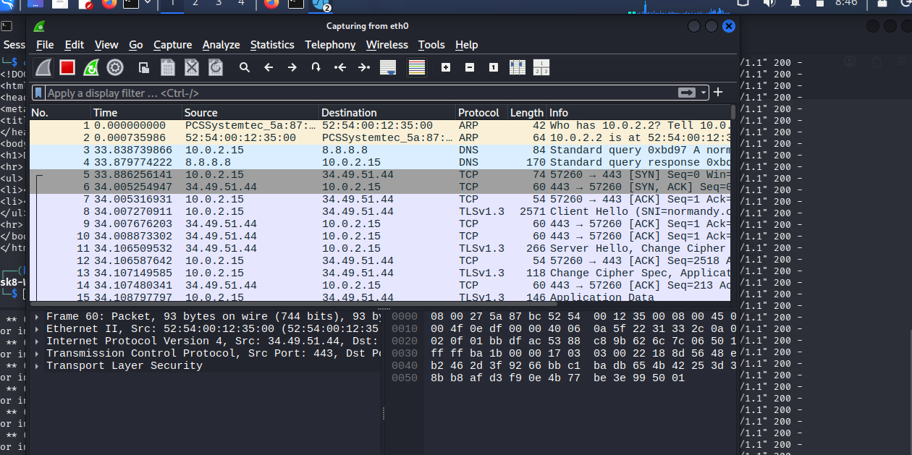
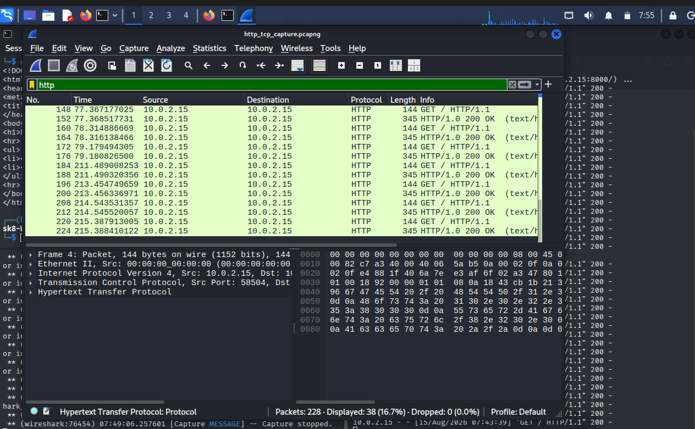
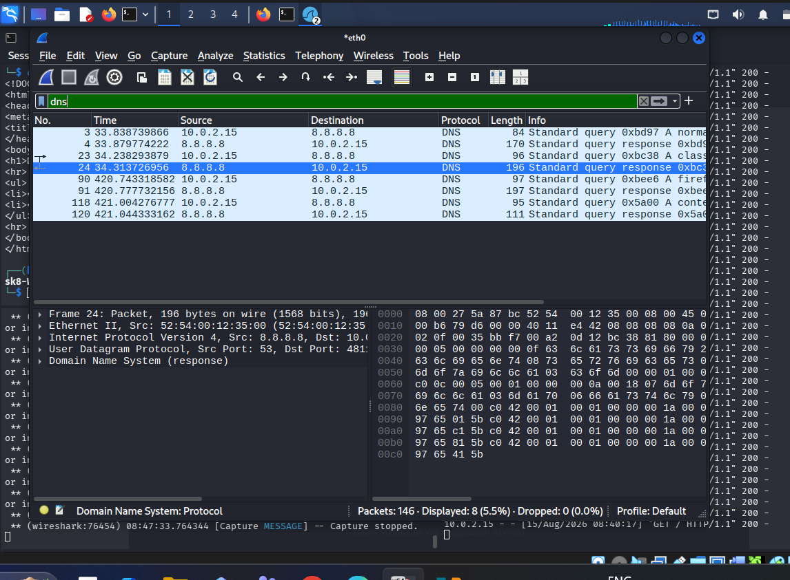
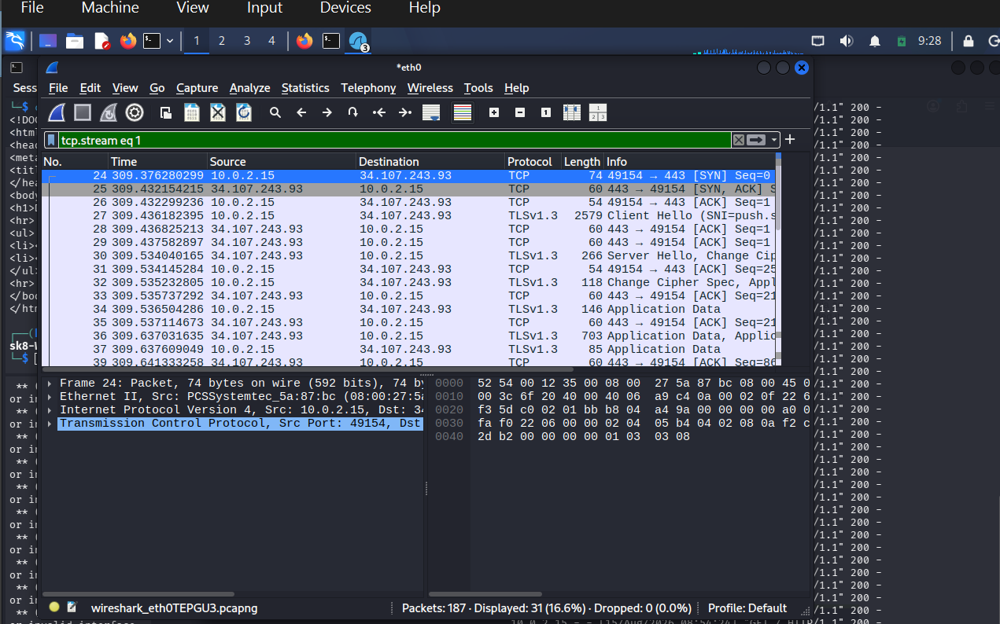
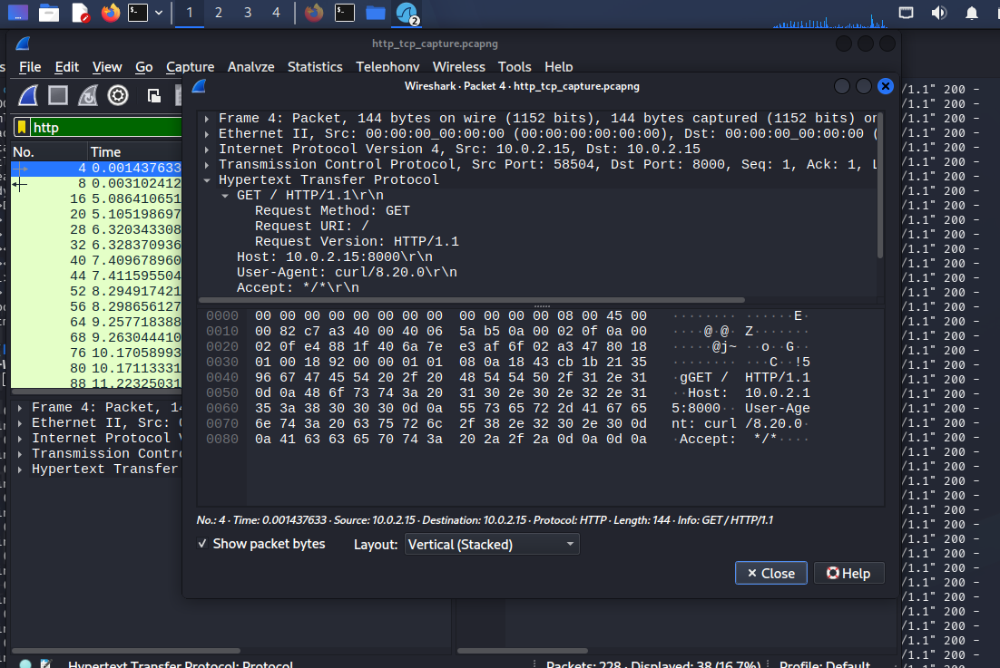

# Task 8 – Capture Network Traffic with Wireshark

## Objective

The objective of this task was to capture live network traffic using Wireshark, apply protocol-specific display filters, analyse packet contents, identify unencrypted HTTP data, examine a TCP three-way handshake, and document security observations.

All traffic analysed in this task was generated within my controlled Kali Linux virtual machine/test environment.

---

## Tools Used

- Wireshark 4.6.6
- Kali Linux
- Local network interface: `eth0`
- Python HTTP server for generating controlled HTTP traffic
- Wireshark display filters

---

## 1. Wireshark Installation and Verification

Wireshark was installed and available on the Kali Linux system.

The installation was verified using:

```bash
which wireshark
```

The executable was located at:

```text
/usr/bin/wireshark
```

The installed version was verified using:

```bash
wireshark --version
```

Version used:

```text
Wireshark 4.6.6
```

Wireshark was run with the permissions required by the Kali Linux environment to capture traffic from the selected interface.

---

## 2. Network Interface

The available network interfaces were checked using:

```bash
ip -br addr
```

The active network interface used for the main capture was:

```text
eth0
```

The local Kali Linux address observed on the interface was:

```text
10.0.2.15
```

The loopback interface (`lo`) was also tested during the task, but the main network capture was performed using `eth0`.

---

## 3. Live Traffic Capture

Wireshark was used to capture live traffic from the `eth0` interface.

The capture was allowed to run while controlled network activity was generated in the test environment.

The final capture contained multiple protocols, including:

- ARP
- DNS
- TCP
- HTTP
- TLS

The captured traffic was then filtered and analysed using Wireshark display filters.

### Capture Overview



---

## 4. HTTP Traffic Analysis

The following Wireshark display filter was used:

```text
http
```

The filter isolated HTTP packets from the capture.

The captured HTTP traffic included HTTP GET requests and HTTP 200 OK responses.

### HTTP Filter Result



The HTTP packets demonstrated that HTTP traffic can be inspected directly when it is not protected by encryption.

---

## 5. DNS Traffic Analysis

The following Wireshark display filter was used:

```text
dns
```

This filter isolated DNS query and response packets.

The capture showed DNS communication between the local system and a DNS server. DNS packets contained information such as the source and destination addresses and DNS query/response details.

### DNS Filter Result



---

## 6. TCP Three-Way Handshake

TCP communication begins with a three-way handshake that establishes a connection between the client and server.

The three steps are:

```text
SYN
The client requests to establish a TCP connection.

SYN-ACK
The server acknowledges the request and responds with its own SYN.

ACK
The client acknowledges the server's response.
```

The TCP packets were analysed using Wireshark.

The following type of packet sequence was observed:

```text
Client → Server    SYN
Server → Client    SYN, ACK
Client → Server    ACK
```

The TCP handshake demonstrates how TCP establishes a reliable connection before application data is exchanged.

### TCP Three-Way Handshake Evidence



---

## 7. Unencrypted HTTP Data

An HTTP request was identified in the captured traffic.

The HTTP GET request was generated against the controlled local test server.

The packet contained readable HTTP information including:

```text
GET / HTTP/1.1
Host: 10.0.2.15:8000
User-Agent: curl/8.20.0
Accept: */*
```

This demonstrates that HTTP traffic is transmitted without encryption.

An observer capable of capturing the traffic could potentially read the HTTP request contents.

### Unencrypted HTTP Packet Evidence



---

## 8. Why Unencrypted HTTP Traffic Is Dangerous

HTTP does not encrypt the application data being transmitted.

Because of this, an attacker who is able to capture network traffic may be able to inspect information contained in HTTP requests and responses.

Depending on the application, this could expose information such as:

- Requested URLs
- HTTP headers
- User-Agent information
- Form data
- Session information
- Other application data

This makes unencrypted HTTP unsuitable for protecting sensitive communication.

---

## 9. How HTTPS Prevents Eavesdropping

HTTPS is HTTP transmitted through a secure TLS connection.

TLS encrypts application data before it is transmitted across the network.

As a result, someone capturing the network packets cannot normally read the protected HTTP application data directly.

HTTPS also provides authentication of the server through digital certificates and helps protect the integrity of transmitted data.

In the capture, HTTPS/TLS traffic appeared as encrypted TLS application data rather than readable HTTP request contents.

Therefore, HTTPS provides significantly stronger protection against network eavesdropping than plain HTTP.

---

## 10. Security Observations

The traffic analysis demonstrated several important security concepts.

### Observation 1 – HTTP exposes application data

The HTTP GET request could be viewed directly in Wireshark because the traffic was unencrypted.

### Observation 2 – HTTPS protects application contents

TLS traffic appeared as encrypted application data, preventing the HTTP contents from being directly viewed in the packet capture.

### Observation 3 – DNS traffic can reveal communication activity

DNS packets can reveal domain-resolution activity even when the subsequent application communication uses HTTPS.

### Observation 4 – TCP establishes connections using a handshake

The TCP SYN, SYN-ACK and ACK sequence demonstrates how a reliable TCP connection is established before data transfer.

### Observation 5 – Security depends on protocol configuration

Using a secure protocol such as HTTPS instead of HTTP is an important security measure for protecting application communication.

---

## 11. Evidence

The following screenshots document the practical work completed during the task.

| Evidence | Description |
|---|---|
| `01-wireshark-http-filter.png` | HTTP traffic filtered using `http` |
| `02-wireshark-dns-filter.png` | DNS traffic filtered using `dns` |
| `03-tcp-three-way-handshake.png` | TCP SYN, SYN-ACK and ACK sequence |
| `04-unencrypted-http-data.png` | Readable unencrypted HTTP GET request |
| `05-capture-overview.png` | Overall Wireshark traffic capture |

---

## 12. Capture File

The Wireshark packet capture was exported in PCAP format:

```text
wireshark_capture.pcap
```

The PCAP file contains the captured network packets used for the analysis in this task.

The repository also contains PCAPNG capture files used during the analysis.

---

# Glossary

## Packet

A packet is a small unit of data sent across a network. A large communication is divided into packets so that it can be transmitted between devices.

## Protocol

A protocol is a set of rules that defines how devices communicate and exchange data over a network.

## Port

A port is a logical communication endpoint used to identify a particular service or application on a device. For example, HTTP commonly uses port 80.

## Payload

The payload is the actual useful data carried inside a network packet after the protocol headers.

## Handshake

A handshake is a sequence of messages exchanged between communicating devices to establish or prepare a connection before normal data transfer begins.

---

## Conclusion

Wireshark was successfully used to capture and analyse network traffic in a controlled local Kali Linux environment.

The task demonstrated how to:

- Capture live network traffic
- Filter HTTP traffic
- Filter DNS traffic
- Analyse TCP communication
- Identify a TCP three-way handshake
- Inspect unencrypted HTTP data
- Understand the security risks of plain HTTP
- Understand how HTTPS and TLS protect application data
- Export and analyse network traffic using a PCAP file

The exercise demonstrates why encrypted communication protocols and secure network configurations are important for protecting information from network eavesdropping.

---

## Ethical Considerations

Network traffic should only be captured on networks and systems that you own, administer, or have explicit permission to test.

This task was performed in a controlled local Kali Linux virtual-machine/test environment for educational purposes.
